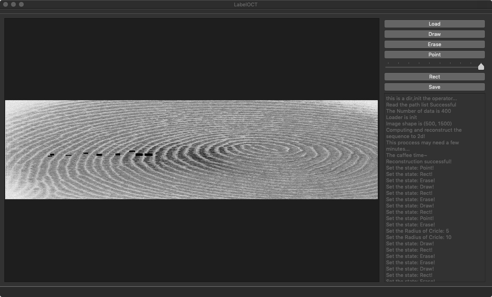
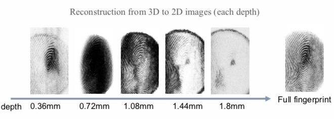
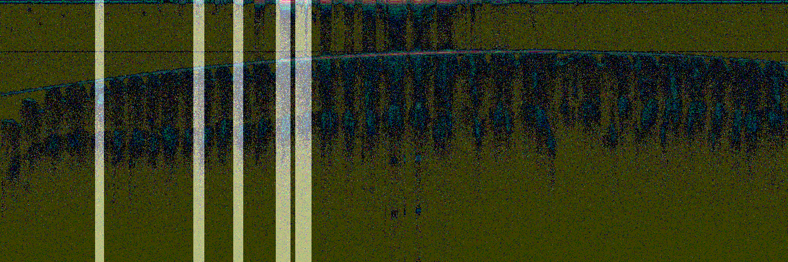
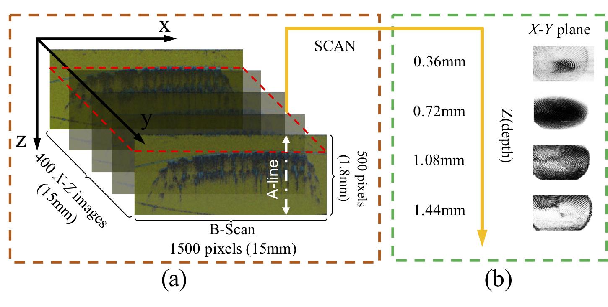

OPEN SOURCE SOFTWARE : LabelOCT
---
This is a special software for labelling OCT fingerprint data, accompanied by a set of sample data open source.
This project is contributed by Institute of Computer Vision, Shenzhen University.


## Contributor

Haozhe.Liu : liuhaozhest@gmail.com Post:M.S. Organization: Shenzhen University

Wentian.Zhang : zhangwentianml@gmail.com Post:Junior Organization:SUST

Feng.Liu : feng.liu@szu.edu.cn POST: Associate research fllow Organization:Shenzhen University

Yong.Qi : qiyong@sust.edu.cn POST: Ph.D Organization:SUST

JiaShu Chen : a1416228373@gmail.com Post:Junior Organization:SUST

HaiMing.Cao : hoiming.wk@foxmail.com Post:Junior Organization:SUST
## Contribution

The use of software is as follows:

1. By the pushButton widget named 'import', the software can reconstruct 3D fingerprints acquisited OCT.


2. After loading the reconstructed image, the software can zoom in by dragging the right mouse button and restore the image size by double-clicking the right mouse button.

3. The software can label 2D fingerprints on reconstructed images by drawing the points and rectangles

4. Software can focus the areas you labeled in the reconstruction that are newly converted into cross sections of fingerprints, so that we can observe their corresponding 3D structure information by labelling 2D reconstructed images.


## Data description
Since the 3D fingerprints used in this software are quite different with traditional 2D fingerprints,
we then introduce our acquisition device and data in detail.
The prototype of the acquisition device equips with a super luminescent diode (SLD) and two identical telecentric lenses.
A source light centred at 840 nm is emitted by the SLD.



Two identical telecentric lenses are used as a focusing lens and a scanning lens.
High-resolution tomography imaging of the internal microstructure of the biological tissue is performed by measuring the interference signal of the sample backscattered light.
Spectral information along the depth direction of fingertip skin, denoted by A-line as labelled in (a), is then obtained using a rate of 18 kHz,
which reach to a depth of about 1.8mm into the skin corresponding to 500 pixels.
The number of A-line in this paper is 1500,
so as to finally get a longitudinal fingertip images with spatial size of 500 × 1500 pixels, as shown in (a).
For 3D scanning, a slow scanning galvanometer is employed to obtain 400 B-scans.
Thus, the 3D fingerprint image captured by our device consists of four hundreds longitudinal fingertip images with spatial size of 500×1500×400 pixels to quantify a real fingerprint area of 15mm×15mm×1.8mm, as the example given in (a).
(b) shows the X-Y tomographic images of the 3D fingerprint, which is the same as traditional 2D fingerprint image but imaging at different depth.

## How to install this software?
It should be noted that software uses several dependency Libraries: PyQt5,scikit-image,numpy

you can use the pip install them, like this,
```shell
pip install PyQt5
pip install scikit-image
pip install numpy
```
and then you can running the software directly at the terminal:

```shell
python main.py
```

## Prospect and Significance of the Project

Optical Coherence Tomography (OCT) can detect about 1mm-3mm below the surface of the skin, and the 3D fingerprint image based on OCT contains the internal information in the fingertips. The internal image of the fingerprint can also avoid the interference of the defects of 2D image, and the number of 3D images scanned by single fingertip is far more than that of 2D.

OCT 3D fingerprint leads us to a new field of fingerprint recognition. It can not only show the surface information, but it provides us a new dimension to explore the distribution of biometrics.

This project can quickly and effectively help researchers discover the representation of traditional 2D fingerprint features in 3D.

## Important statements
1. The software uses GPL protocol and strictly abides by GPL protocol.
2. We consider this to be an important and promising research direction in Biometric and welcome any form of **academic cooperation** to promote the development of this field.
3. Statement for our open source data and software: **No commercial or illegal using.**

## Contact information
**Academic communication and discussion are welcome.**

My email :liuhaozhest@gmail.com

My tutor :feng.liu@szu.edu.cn

## Acknowledgement
The work is partially supported by the Natural Science Foundation of China(61672357, 61573248, 61802267, 61732011 and U1713214),the Science and Technology Funding of Guangdong Province(2017A030313367 and 2018A050501014), the Education Department of Shaanxi Province (15JK1086), and Shaanxi University of Science and Technology Dr.Foundation (BJ14-07).

As an undergraduate student, I am very grateful to the two teachers(Feng.Liu and Yong.Qi) for their guidance and care in my academic and life.
